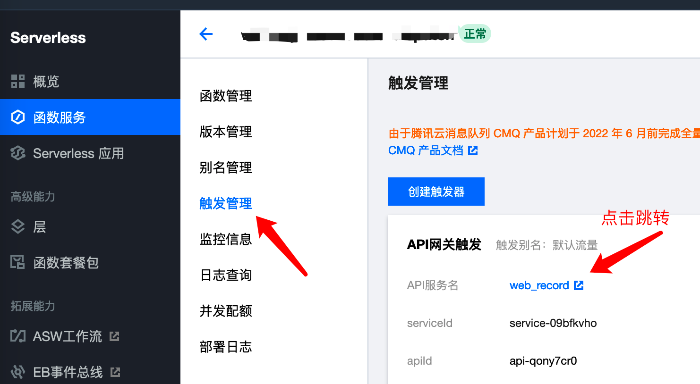
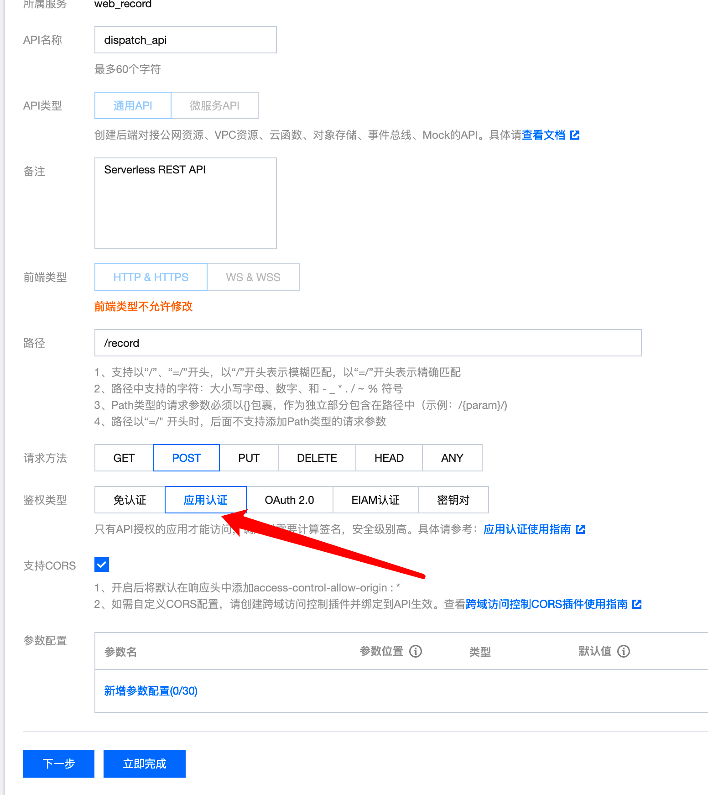
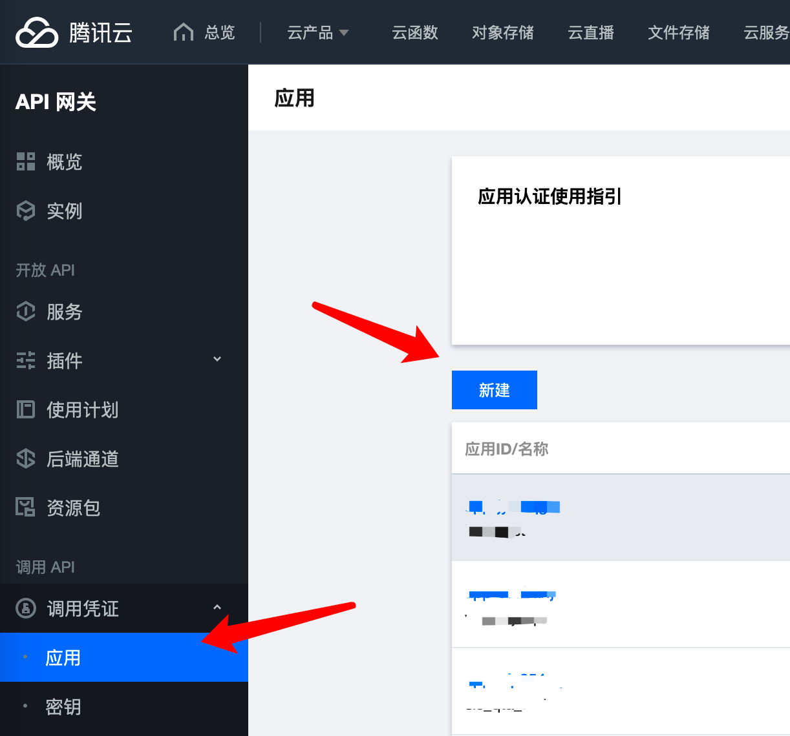
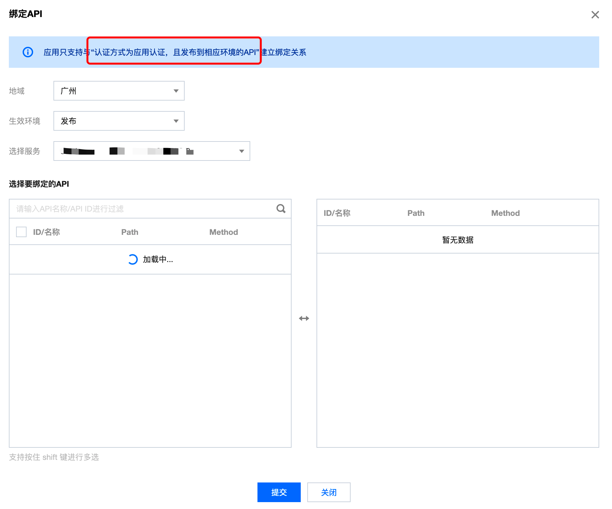

# API网关开启应用认证

在云函数SCF上基于模板或者部署应用后，默认关联的API网关可能是免认证的，安全级别较低，可以通过配置成 应用认证 方式，来加强安全认证。

## API网关配置

函数服务 -> 触发管理 -> API网关触发

跳转到 api网关服务 控制台，切换 鉴权类型 为 应用认证

## 应用认证配置

API网关控制台，调用凭证 -> 应用 -> 新建

关联要绑定的API网关服务

补充：`ApiAppKey` 和 `ApiAppSecret` 在应用页面获取

## 认证签名生成

参考文档（java）：https://cloud.tencent.com/document/product/628/58187
