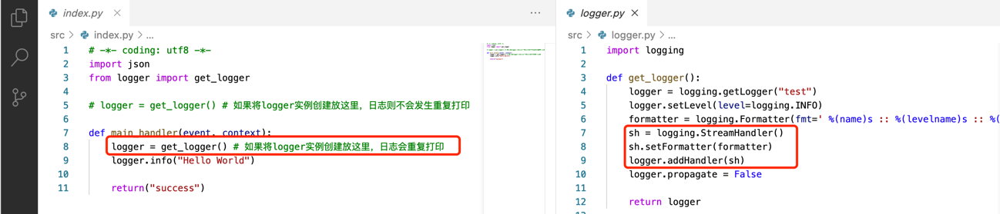

# 异常的日志重复问题

在代码中声明了一行日志打印，云函数的某一次运行，却连续打印出多条重复日志

## 问题现象

以语言环境 `Python 3.6` 和 `logging` 日志模块为例说明下，具体代码样例如下：
将 `logger` 实例创建放到函数 `main_handler()` 内，则会发生日志重复现象

## 问题说明

1、云函数默认支持实例复用

云函数部署好之后，第一次运行会有冷启动，接下来再继续运行，为了避免冷启动现象，会直接复用实例。

云函数可以类比成一个 `http server` 常驻进程（当发生实例复用时，`http server` 就一直都在）
云函数的一次触发执行，就好比一次http请求，请求入口就是 `main_handler()`；当函数实例不再复用时，
常驻进程才会真正销毁。

2、日志实例的初始化位置

在实例复用场景下，将 `logger` 实例创建放到函数 `main_handler()` 内，N 次函数触发，就会多创建 N 个 `stream`，
导致出现了日志重复现象。

## 问题解决

将日志实例 `logger` 的创建放到函数 `main_handler()` 外。

