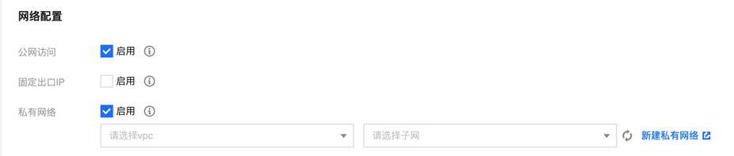
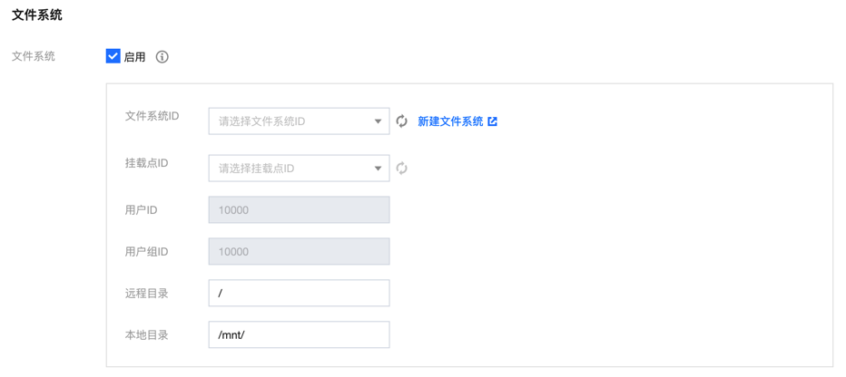

# Ffmpeg 配置输出日志到指定文件

[云函数（SCF）](https://cloud.tencent.com/document/product/583) 一个主要场景就是跑视频任务，比如视频转码、推流等，常用方法就是基于 ffmpeg 来执行。
接下来，介绍下如何将 [ffmpeg](https://ffmpeg.org/) 的输出日志落盘到指定文件。

## 添加文件系统

### 网络配置

开启私有网络并设置

页面路径：函数设置 -> 高级设置 -> 网络配置



### 文件系统

开启文件系统，选择期望的 `cfs` 文件系统，并正确设置远程目录和挂载点（本地目录，例如/mnt）



## 输出日志的配置

推荐使用环境变量 `FFREPORT="level=48:file=/tmp/test02.log"` 的方式来配置日志级别和日志文件名，其中 `level` 指定日志级别，
`file` 指定输出日志的落盘文件名。

日志级别 `level` 字段值使用整数标识，可选值有：
- 8: AV_LOG_FATAL
- 16: AV_LOG_ERROR
- 24: AV_LOG_WARNING
- 32: AV_LOG_INFO
- 40: AV_LOG_VERBOSE
- 48: AV_LOG_DEBUG
- 56: AV_LOG_TRACE

注意：`FFREPORT` 环境变量配置可与参数字段 `-loglevel` 配置共存，输出形式有差异，但互不影响。

## 具体示例

接下来以视频转码为例说明下（语言环境是python3.6)：

```python
# ffmpeg命令
# 视频压缩
video_press = 'FFREPORT="level=48:file=/tmp/ffmpeg-%s.log" /tmp/ffmpeg  -i %s -r 10 -b:a 32k %s -y'

def main_handler(event, context):
    req_id = context["request_id"]
    
    subprocess.run(video_press % (req_id, download_path, upload_path), stdout=subprocess.PIPE,
                               stderr=subprocess.PIPE,
                               close_fds=True, shell=True)
```
