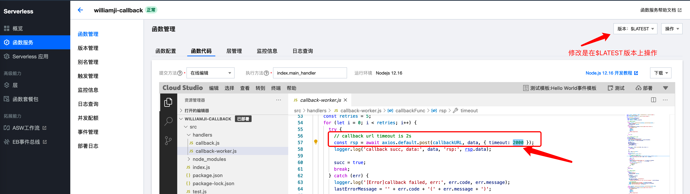
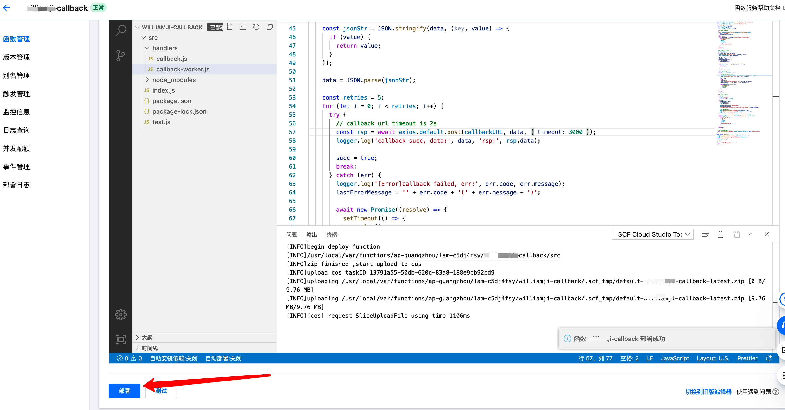

# 全景录制的回调超时时间调整

## callback 函数

全景录制应用中的callback函数负责实现回调功能，当录制结束之后，负责通过客户做进一步处理。

## 修改方式

修改路径是：callback函数 -> 函数管理 -> 函数代码 

代码路径是：src -> handlers -> callback-worker.js

修改完成之后，<mark style="color:red;">点击部署</mark>

补充：超时时间修改，比较简单，在$LATEST版本承接流量的前提下， 也可以直接在$LATEST版本上操作修改和部署，但是建议在没有录制任务的时候操作。
