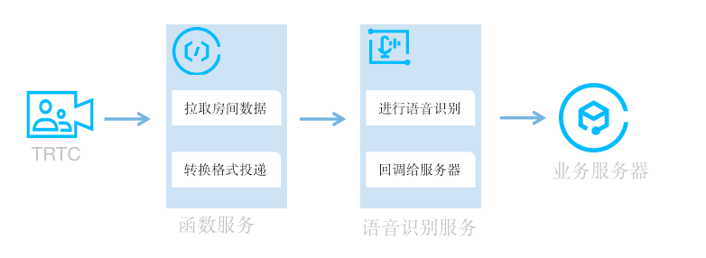

# ASR语音识别应用实践指导

ASR 语音识别引用深度融合了腾讯云 ASR 和 TRTC，用于将 TRTC 房间的语音数据实时放回，
应用运行在云函数 SCF 上，通过 API 网关暴露请求入口，客户可以直接请求 API 快速发起 TRTC 房间的语音识别。

补充：ASR 语音识别应用的官方指导文档（https://cloud.tencent.com/document/product/1154/65812）


## 整体架构预览

整体流程如下：


## 环境变量
在应用部署之后，可以通过修改环境变量调整（或者开启）应用的某些特性，目前支持的环境变量有：
- `ENV_REALTIME_ENABLE=true` 返回识别中间结果，不设置该环境变量只返回一句话识别完成后的结果
- `ENV_ENGINETYTE=16k_en` 语音识别引擎，配置16k_en，不设置该环境变量默认使用16k_zh
- `DEBUG=on` 开启debug模式

## API 网关
应用部署之后，API 网关默认是开启了应用认证，如果请求端不支持应用认证方式，则会返回如下报错：
```shell
HMAC signature cannot be verified
```

建议：

1、测试时，可以先调整 API 网关的认证模式 为 免认证。

2、使用应用认证方式，以 golang 语言为例，参考：https://cloud.tencent.com/document/product/628/56544

## TRTC 房间的高级权限控制

线上的 TRTC 房间往往都会开启高级权限控制，而当前最新版的 ASR 语音识别应用也支持了开启了高级权限控制的房间加入。
请求示例参考如下：
```shell
{
    "SdkAppId": 1400000000,
    "RoomId": 43474,
    "UserId": "user_55952145",
    "UserSig": "eJwtzNEKgkAUBNBxxxxxxx",
    "Callback": "https:xxxxxxxx.com/post/xxx"
    "PrivateKey": "xxxxxxxxx"
}

```

补充：TRTC 的高级权限控制（https://cloud.tencent.com/document/product/647/32240）