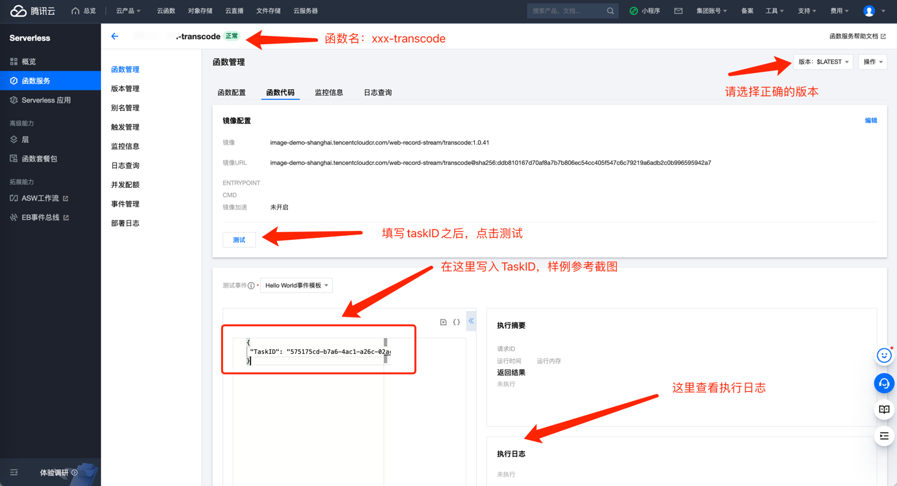

# 全景录制中转码函数启动失败问题

## 问题现象

现象1：镜像下载失败，报错内容如下：
```shell
{"Version":"1.0.20","TaskID":"ade96418-947e-4872-847d-7b25cbe6b858","Message":"invoking scf:transcode..."}

{"Message":"extend lock succ, expiration 1661926957256, now 1661926947360"}

{"Version":"1.0.20","TaskID":"ade96418-947e-4872-847d-7b25cbe6b858","Message":"[Error]invoke function failed InvokeResult !=0 && !=200 res: {\n  RequestId: '3ed7a13c-4047-4c17-a424-5ea09eec763a',\n  Result: {\n    BillDuration: 0,\n    ColdStart: false,\n    ColdStartDuration: 0,\n    Duration: 0,\n    ErrMsg: 'image: pull image failed',\n    FunctionRequestId: '3ed7a13c-4047-4c17-a424-5ea09eec763a',\n    InvokeResult: 444,\n    Log: '',\n    MemUsage: 0,\n    RetMsg: 'image: pull image failed',\n    StatusCode: 444\n  }\n}"}
```

## 问题说明

在全景录制应用中，转码函数如果启动失败，会导致后续动作（转码、上传目标存储、Callback回调等）都无法正常执行。
这篇文档主要介绍下，如果转码函数启动失败，如何进行补救动作。

## 补救动作介绍

补救动作是在官文控制台上操作，操作步骤如下：

1、找到具体的应用名，点击进入应用详情。

2、找到 `xxx-transcode` 函数，点击进入转码函数详情。

3、参考如下截图，进行补救动作：



- 确认函数的版本，默认是 `$LATEST`
- 测试事件选择：`Hello World事件模板`
- 输入框内输入 `TaskID`，样例参考：
```shell
{
 "TaskID": "575175cd-b7a6-4ac1-a26c-02acb46937f9"
}
```
- 输入 `TaskID` 之后，点击 `测试`
